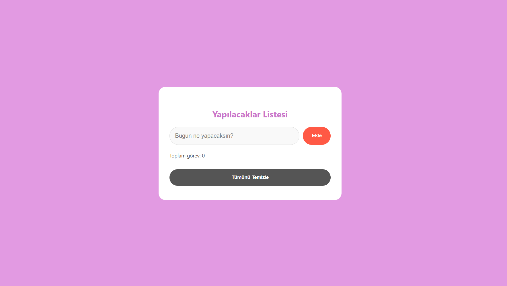

#  Yapılacaklar Listesi (To-Do List)

Basit ve kullanıcı dostu bir **Yapılacaklar Listesi (To-Do List)** web uygulamasıdır.
Kullanıcılar görev ekleyebilir, tamamlanan görevlerin üstünü çizebilir ve görevleri silebilir.
Ayrıca görevler **tarayıcıda saklanır (LocalStorage)**, böylece sayfa yenilendiğinde kaybolmaz.

---

##  Özellikler

* ➕ Görev ekleme
* ⌨️ **Enter tuşu ile hızlı ekleme**
* ✔️ Görevi tamamlandı olarak işaretleme
* 🗑️ Görev silme
* ⚠️ **"Acil" yazan görevleri farklı renkte gösterme**
* 💾 **LocalStorage ile görevleri kaydetme**
* 🔢 Görev sayacı
* 🧹 Tüm görevleri temizleme butonu
* 🎨 Basit ve modern arayüz tasarımı

---

##  Kullanılan Teknolojiler

* HTML5
* CSS3
* JavaScript (Vanilla JS)
* Font Awesome (ikonlar için)

---

##  Proje Yapısı

```
 hafta-6-todo
│
├── index.html
├── style.css
├── script.js
├── screenshot.png
└── README.md
```

---

##  Proje Görünümü



```

---

##  Amaç

Bu proje, **JavaScript DOM manipülasyonu**, **event handling** ve **LocalStorage kullanımı** konularını öğrenmek amacıyla geliştirilmiştir.

---

